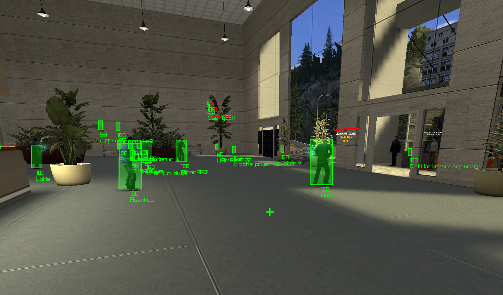
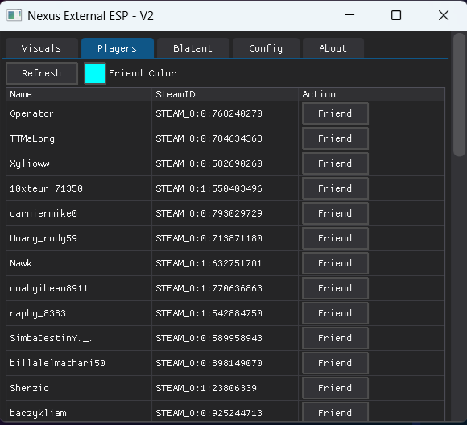
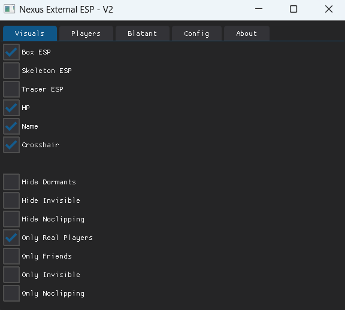
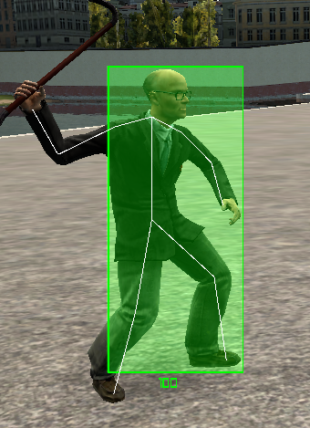

# Gmod-Nexus-External-ESP V2

## About
Nexus is an open-source Python external ESP, triggerbot and bhop compiled with PyInstaller **for GMOD x64**.  
It's external : nothing is injected, no lua code is used/edited.  
  
The visuals are not in the game: it's another application which is on top of gmod.  
So it's impossible to detect, impossible to screengrab.  

|Features|Methods|Undetectable
|-|-|-|
ESP|Reading game memory only|✅
Dynamic Crosshair|Reading game memory only|✅
Triggerbot|Reading game memory and sends inputs|-
Bhop|Read and Write to game memory|-
---

## Screenshots

  
  

  
  

  
## Download
https://github.com/Calvineries/Gmod-Nexus-External-ESP/releases/
  
## Common issues
|Issue|Solution|
|-|-|
I don't see the ESP.|Use video setting: **Borderless window**.
The cheat doesn't detect gmod.|Use the beta gmod version: **Chromium x64**.
The offsets are outdated.|You can use my "offset dumper" to get the new offsets: https://github.com/Calvineries/gmod-x64-offsets-dumper
How to install dependencies for the uncompiled version.|- Install the "dearpygui", "pywin32" and "requests" modules using pip. - Download and install pyMeow : https://github.com/qb-0/pyMeow
In Singleplayer the ESP doesn't work. Bots are not displayed on the ESP.|Uncheck "Only Real Players"
The overlay is black (non transparent).|- Solution 1: Change the "OpenGL GDI Compatibility" in Nvidia Control Panel to "Prefer compatibility". - Solution 2: Make the application (if compiled), or python (if not compiled) use your integrated graphics card instead of your graphics card (or the opposite).
Some player names appear as "______".|These names contain non-Latin characters. To display them, you must place a font file named "font.ttf" in the "font" folder.
Where is the old version.|https://github.com/Calvineries/Gmod-Nexus-External-ESP/tree/v1-(old-version)

## Contributions to the code are welcome!
